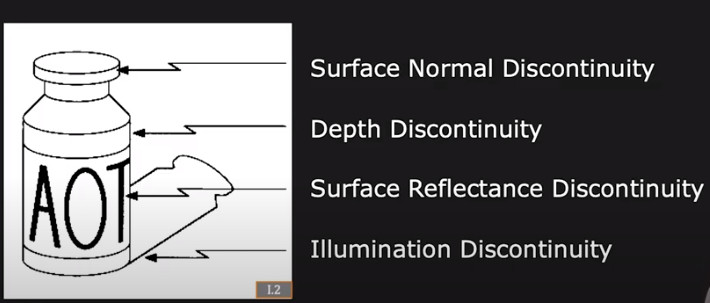
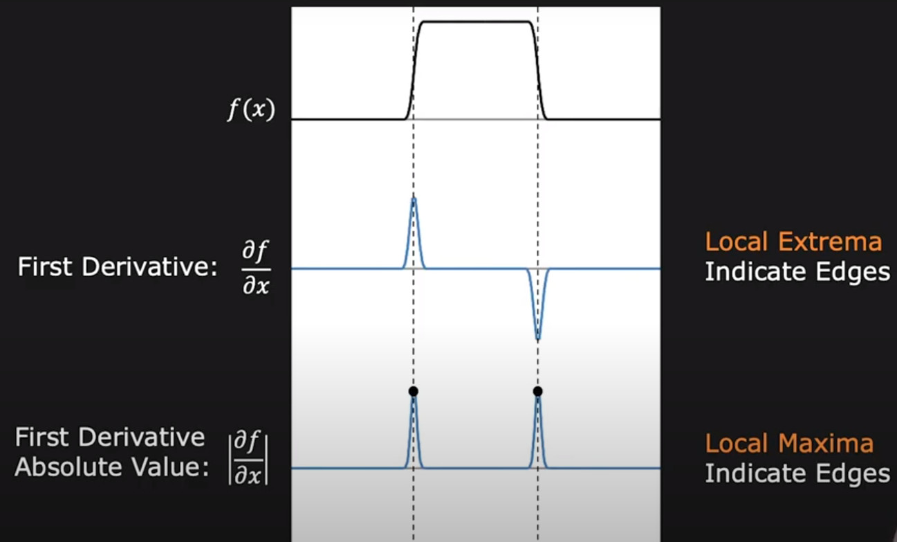
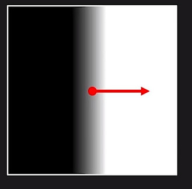
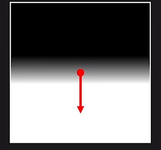
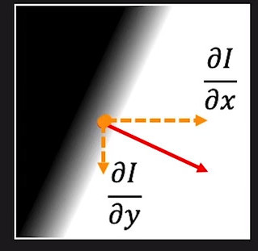
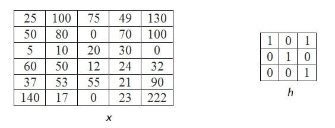
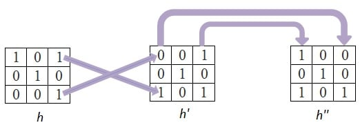

<!-- <style>body {text-align: left}</style>
<div style="text-align: left">
-->
# Edge Detection
Rapid changes in image intensity in small window caused by:





- Position
- Magnitude
- Orientation


# Image Coordinate System

The **x-coordinate** is defined here as increasing in the **"right"-direction**, and the **y-coordinate** is defined as increasing in the **"down"-direction**.

<!-- 

-->


# Edge Detection Using First Derivative, Gradient Operator

First derivative edge detection provides both location and strength




<!-- 

-->





<!-- 

-->





<!--

 -->





The simplest approach is to use central differences:

<!-- 

-->


<!-- 

-->


while the gradient orientation can be estimated as:

<!-- 

-->


- good localization

- noise sensitive


## Roberts cross
Gradient of an image through discrete differentiation which is achieved by computing the sum of the squares of the differences between **diagonally** adjacent pixels.

we convolve the original image, with the following two kernels:


<!-- 

-->


Let 
<!-- 
 
-->


be a point in the original image and 

<!-- 
 
-->


be a point in an image formed by convolving with the first kernel and 
<!-- 

-->


be a point in an image formed by convolving with the second kernel. The gradient can then be defined as:

<!-- 

-->


direction of the gradient:

<!-- 

-->


## Prewitt
<!-- 

-->


where  <!--  -->  here denotes the 2-dimensional convolution operation.

Prewitt it is a separable filter (can be decomposed as the products of an averaging and a differentiation kernel), therefore <!--   --> can be written as:

<!-- 

-->


## Sobel
<!-- 

-->


Sobel is a separable filter (can be decomposed as the products of an **averaging and a differentiation kernel**), therefore

<!-- 
 -->


Refs: [1](https://www.youtube.com/watch?v=G8yp6f9V_6c)

# Edge Detection Using Second Gradient
differential approach of detecting zero-crossings


Second-order derivatives can be computed from the scale space representation  according to:


<!-- 

-->


corresponding to the following filter masks:

<!-- 

-->


- Edges are zero crossing in Laplacian image
- Laplacian doesn't provide direction of edges

# Difference of Gaussians (DoG) 
Convolution Properties: Associativity

<!-- 
 
-->


First derivative is linear operation, Gaussian smoothing is also linear operation so we can find the first derivative of Gaussian 

# Laplacian of Gaussian (LoG)

# Canny Edge

# Gabor Filter


# Separable Filter

A 2-dimensional convolution operation is separated into two 1-dimensional filters. 

 This reduces the computational costs on an  <!--  -->  image with a
 <!-- 
  --> 
 
 
 
 filter from  <!--   -->  down to <!--
 -->

   

Examples:

1. Smoothing filter:


<!--

-->


2. Weighted smoothing filter:

<!--

-->


3. Sobel operator:

<!-- 

-->


# Convolution


Filtering often involves replacing the value of a pixel in the input image F with the weighted sum of its neighbors

convolution of 5×5 sized image matrix `x` with the kernel `h` of size 3×3, 




kernel flipping and mirroring:




sliding the kernel over the image:


# Non Linear Filtering

## Bilateral Filter
## Median Filter


1. The function does actually compute correlation, not the convolution
2. That is, the kernel is not mirrored around the anchor point. If you need a real convolution, flip the kernel using flip and set the new anchor to `(kernel.cols - anchor.x - 1, kernel.rows - anchor.y - 1)`.
3. The function uses the DFT-based algorithm in case of sufficiently large kernels (~11 x 11 or larger) and the direct algorithm for small kernels.


```cpp
void filter2D(Mat src,
              Mat dst,
              int ddepth,
              Mat kernel,
              Point anchor,
              double delta,
              int borderType);
```

</div>


Refs: [1](https://www.youtube.com/watch?v=lOEBsQodtEQ&t)
