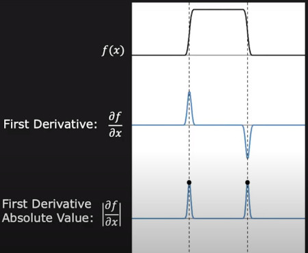
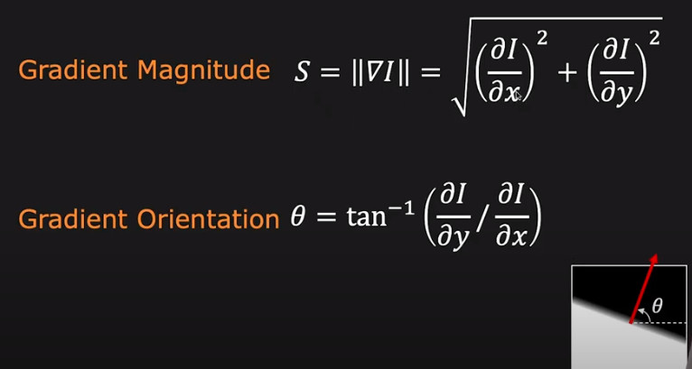
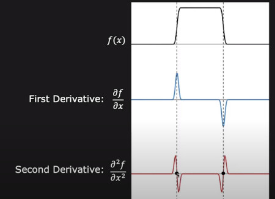

<style>body {text-align: left}</style>
<div style="text-align: left">

# Edge Detection
Rapid changes in image intensity in small window caused by:


- Position
- Magnitude
- Orientation


# Image Coordinate System

The **x-coordinate** is defined here as increasing in the **"right"-direction**, and the **y-coordinate** is defined as increasing in the **"down"-direction**.


# Edge Detection Using First Derivative, Gradient Operator

First derivative edge detection provides both location and strength



<!-- 

-->


The simplest approach is to use central differences:


while the gradient orientation can be estimated as:


- good localization

- noise sensitive


## Roberts cross
Gradient of an image through discrete differentiation which is achieved by computing the sum of the squares of the differences between **diagonally** adjacent pixels.

we convolve the original image, with the following two kernels:


<!-- 

-->


Let 
 
be a point in the original image and 
 
be a point in an image formed by convolving with the first kernel and 

 be a point in an image formed by convolving with the second kernel. The gradient can then be defined as:


direction of the gradient:


## Prewitt


where   here denotes the 2-dimensional convolution operation.

Prewitt it is a separable filter (can be decomposed as the products of an averaging and a differentiation kernel), therefore  can be written as:


## Sobel


Sobel is a separable filter (can be decomposed as the products of an **averaging and a differentiation kernel**), therefore


Refs: [1](https://www.youtube.com/watch?v=G8yp6f9V_6c)

# Edge Detection Using Second Gradient
differential approach of detecting zero-crossings



Second-order derivatives can be computed from the scale space representation  according to:


corresponding to the following filter masks:


- Edges are zero crossing in Laplacian image
- Laplacian doesn't provide direction of edges

# Difference of Gaussians (DoG) 
Convolution Properties: Associativity

 


First derivative is linear operation, Gaussian smoothing is also linear operation so we can find the first derivative of Gaussian 

# Laplacian of Gaussian (LoG)

# Canny Edge

# Gabor Filter


# Separable Filter

A 2-dimensional convolution operation is separated into two 1-dimensional filters. 

 This reduces the computational costs on an   image with a
  filter from   down to 
   

Examples:

1. Smoothing filter:


2. Weighted smoothing filter:


3. Sobel operator:


# Convolution


Filtering often involves replacing the value of a pixel in the input image F with the weighted sum of its neighbors

convolution of 5×5 sized image matrix `x` with the kernel `h` of size 3×3, 


kernel flipping and mirroring:


sliding the kernel over the image:


# Non Linear Filtering

## Bilateral Filter
## Median Filter


1. The function does actually compute correlation, not the convolution
2. That is, the kernel is not mirrored around the anchor point. If you need a real convolution, flip the kernel using flip and set the new anchor to `(kernel.cols - anchor.x - 1, kernel.rows - anchor.y - 1)`.
3. The function uses the DFT-based algorithm in case of sufficiently large kernels (~11 x 11 or larger) and the direct algorithm for small kernels.


```cpp
void filter2D(Mat src,
              Mat dst,
              int ddepth,
              Mat kernel,
              Point anchor,
              double delta,
              int borderType);
```

</div>


Refs: [1](https://www.youtube.com/watch?v=lOEBsQodtEQ&t)
