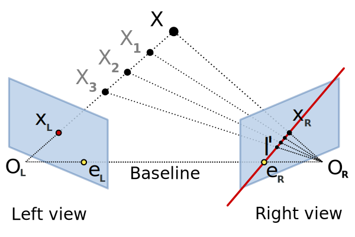

# Essential Matrix

 Essential matrix  is a  that relates optical center of cameras

We can relate any two frame by a rotation matrix and a translation vector:
 
 

 
 

We cross product both side by :
 
 

 
 
For any vector cross product of with itselt is zero:
 
 

 
 

We dot product both side by :
 
 

 
 
on the lhs,    is perpendicular to 
so the result is zero vector, also we can write any cross product as skew-symmetric matrix multiplication, therefore:
 
 

 
 

 
 

Refs: [1](https://en.wikipedia.org/wiki/Essential_matrix)

