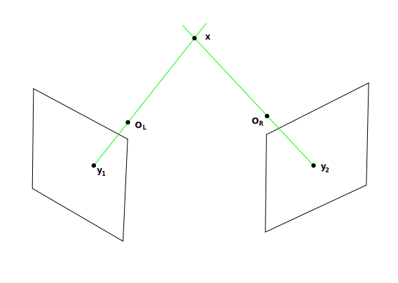

# Fundamental Matrix

If we have camera matrix we can compute the **ray** that goes the through optical center of  (left cameras) and  (right camera) and the point  :

  

 
 

 
 

 
 

 
 

 
 

Also from essential matrix we know:
 
 

 
 
if we substitute them in the upper equation:
 
 

 
 

 
 

we call the  matrix **Fundamental Matrix**: 

 
 

 
 

 
 

Now how to compute it:
 
 

if we write this equation for 8 points, we can arrange the following matrix:

 
 
the above equation has zero on the rhs, so we can use SVD to solve it,
 
 

Singular-value Decomposition (SVD) of any given matrix 

 
 
 

-  is an  matrix with orthogonal matrix (columns are eigen vectors of A).
-  is an  matrix with non-negative entries, termed the singular values  (diagonal entries are eigen values of A).
-  is an  orthogonal matrix.

 is the last column of 

However, this is not the complete answer, let have a review: the cross product can be written as:
 
 

where:
 
 

This matrix has rank of 2 and if we multiply it by any matrix, that would also have rank 2.

 
 
s>t" title="https://latex.codecogs.com/svg.image?r>s>t" />
 
 
so we set the  is 
 
 

and compute :
 
 

If we compute the SVD of  the last column of  is  that we looking for.

Now that we have  if we set a point on the left camera  it will give us a line on the other camera.
 
 

To find the epipoles, since every line should go through that, so in teh fowlloing equation:

 
 

 
 

[code](../src/fundamental_matrix_estimation.cpp)    

Refs: [1](https://www8.cs.umu.se/kurser/TDBD19/VT05/reconstruct-4.pdf), [2](http://www.robots.ox.ac.uk/~vgg/hzbook/code/)

