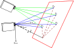

# Homography
Any two images of the same planar surface in space are related by a homography

   


<br/>


<br/>


<br/>
<br/>
<br/>


<br/>
<br/>
<br/>


Singular-value Decomposition (SVD) of any given matrix 

<br/>
<br/>
<br/>


 is the last column of 


# OpenCV API

```cpp
cv::getPerspectiveTransform

cv::warpPerspective

cv::perspectiveTransform

cv::findHomography
```

[code](../src/homography.cpp)

