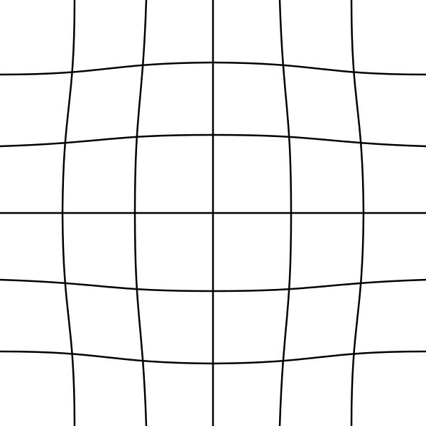

# Camera Lenses

# Tilt Shift Lenses

Refs: [1](https://en.wikipedia.org/wiki/Tilt%E2%80%93shift_photography) 

# Fisheye Lenses

# Rectilinear Lenses
A rectilinear lens produces images in which straight features, such as the edges of building walls, appear with straight lines rather than curves. In other words, it is a lens that exhibits little or no pincushion or barrel distortion.
As an object gets closer to the edge of the frame, the rectilinear perspective will make it appear as though it is being stretched and enlarged. Lenses of this kind are frequently employed to produce forced perspective effects.

## Radial Distortions

The lens isn't a perfect pinhole, which has the side consequence of causing symmetric radial distortion. Outside of the perspective center, light enters the lens and bends toward the image plane. The best way to understand symmetric radial distortion could be to imagine that the concavity or convexity of the lens is being used to map the image plane. Because all light passes through a single point in a pinhole camera, there would be no distortion.

Because it solely models distortion as a function of distance from the center of the image plane, this distortion is described as being symmetric. Radial distortion only has a geometric impact in the radial direction,

### Pincushion Distortion

### Barrel Distortion

### Mustache Distortion

### Tangential Distortions
Decentering distortion is a result of the lens assembly not being centered over and parallel to the image plane as the main reason.

[image courtesy](https://www.tangramvision.com/blog/camera-modeling-exploring-distortion-and-distortion-models-part-i)

[image courtesy](https://www.researchgate.net/publication/260728375_Laboratory_calibration_of_star_sensor_with_installation_error_using_a_nonlinear_distortion_model)

 
 

### Lens Chromatic Aberration

## Distortion Models

### Brown-Conrady

The Brown-Conrady model corrects both for radial distortion and for tangential distortion as a series of higher order polynomial. In the following all points are n the image plane with Cartesian coordinate and not pixel based coordinate.

#### Radial Distortion

 
 

 
 

 

 is the distorted image point

 

 is the undistorted image point

 

 is the distortion center

 

 
 

#### Tangential distortion:
 
 

 

 
 

#### Both Distortion Together

 is the  radial distortion coefficient.

 is the  tangential distortion coefficient.

In practice, only the ,  and  and ,  
terms are typically used

- Barrel distortion typically will have a negative term for  
- Pincushion distortion will have a positive value for  . 
- Moustache distortion will have a non-monotonic radial geometric series where for some  the sequence will change sign.

### Division Model

provides a more accurate approximation than Brown-Conrady's even-order polynomial model. For radial distortion, this division model is often preferred over the Brown–Conrady model, as it requires fewer terms to more accurately describe severe distortion

Refs: [1](https://www.tangramvision.com/blog/camera-modeling-exploring-distortion-and-distortion-models-part-i),
[2](https://www.robots.ox.ac.uk/~vgg/publications/2001/Fitzgibbon01b/fitzgibbon01b.pdf), [3](https://www.microsoft.com/en-us/research/wp-content/uploads/2016/02/tr98-71.pdf), [4](https://ori.codes/artificial-intelligence/camera-calibration/camera-distortions/), [5](https://docs.opencv.org/4.x/dc/dbb/tutorial_py_calibration.html)

# OpenCV API

 
 

## Image Resolution and Calibration Parameter
The distortion coefficients  
do not depend on the scene viewed and they remain the **same** regardless of image resolution. If, for example, a camera has been calibrated on images of 320 x 240 resolution, absolutely the same distortion coefficients can be used for 640 x 480 images from the same camera

However, , , , and  need to be scaled appropriately.

In OpenCV `cv::undistort`does the followings:
For each pixel of the destination lens-corrected image do:

- Convert the pixel coordinates `(u_dst, v_dst)` to normalized coordinates `(x_d, y_d`) using the inverse of the calibration matrix `K`,
- Apply the lens-distortion model, as displayed above, to obtain the distorted normalized coordinates `(x_u, y_u)`,
- Convert `(x_u, y_u)` to distorted pixel coordinates using the calibration matrix `K`,
- Use the interpolation method of your choice to find the intensity/depth associated with the pixel coordinates `(u_src, v_src)` in the source image, and assign this intensity/depth to the current destination pixel.

Refs: [1](https://docs.opencv.org/2.4/modules/calib3d/doc/camera_calibration_and_3d_reconstruction.html#camera-calibration-and-3d-reconstruction), [2](https://stackoverflow.com/questions/21958521/understanding-of-opencv-undistortion)

