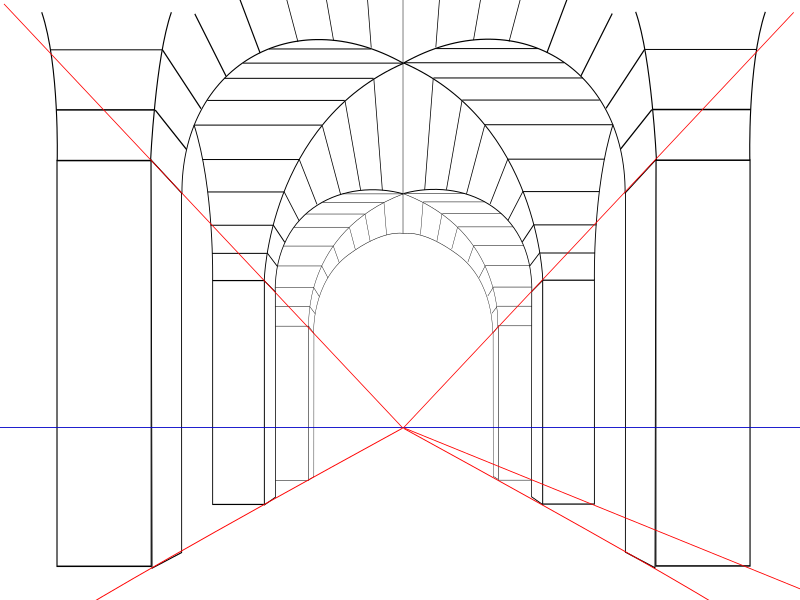
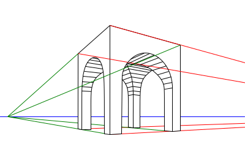
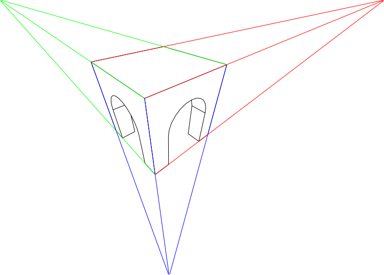
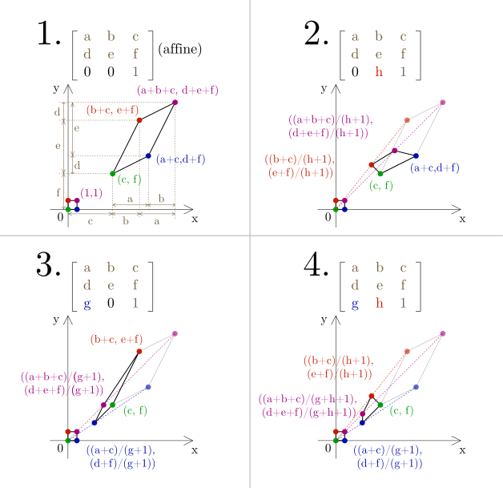

# Perspective projection

Perspective projection or perspective transformation is a linear projection where three dimensional objects are projected on a picture plane. This has the effect that distant objects appear smaller than nearer objects. Lines which are parallel in nature (that is, meet at the point at infinity) appear to intersect in the projected image. 
perspective transformation is change of view point. perspective preserve collinearity and incidence (straight lines will remain straight) but parallelism , length and angle may not preserved.

depending on the orientation of the projection plane towards the axes of the depicted object, perspective projection is categorized into **one-point**, **two-point** and **three-point** perspective.

## One Point Perspective
In one point perspective all lines recede toward one vanishing point.

  

## Two Point Perspective
In two point perspective, lines converge on two vanishing points.
 
  

## Three Point Perspective
In three point perspective all lines recede toward one of the three vanishing points.

  

image courtesy: [1](https://en.wikipedia.org/wiki/3D_projection)

# Weak perspective projection

# Perspective Transformation Matrix

Affine Transformation Matrix had the following form:
 

  

Perspective Transformation Matrix has the following form:

  

 
This is the rotation part:
 

 
This is the translation part:
 

 
This is the projection part:
 

## Effect of Affine vs Perspective Transformation
 

# OpenCV Perspective function
The function `cv::warpPerspective` transforms the source image using the specified matrix:

