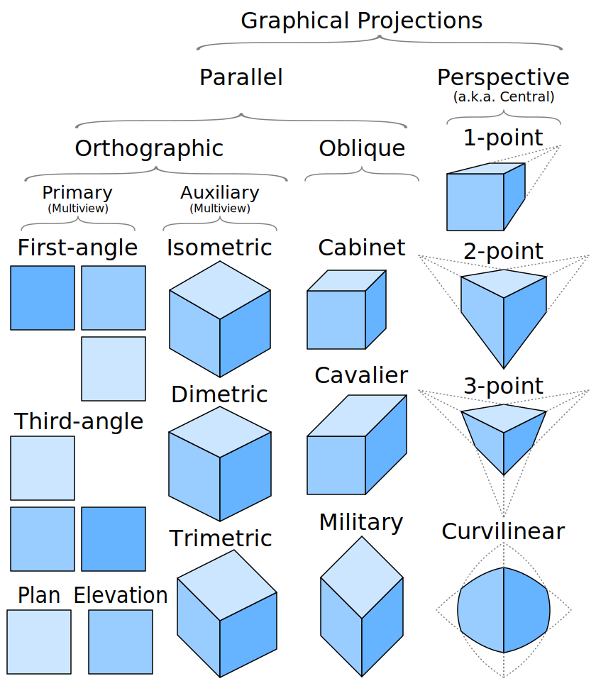
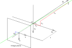
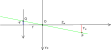

# Graphical Projection

There are two graphical projection categories:

- parallel projection
- perspective projection





# Pinhole Camera Model

the coordinates  of point  depend on the coordinates of point  

- 

- 






Refs: [1](https://en.wikipedia.org/wiki/Pinhole_camera_model#Geometry),
[2](https://ksimek.github.io/2013/08/13/intrinsic/),


# Rotated Image and the Virtual Image Plane

The mapping from 3D to 2D coordinates described by a pinhole camera is a perspective projection followed by a `180°` rotation in the image plane. This corresponds to how a real pinhole camera operates; the resulting image is rotated `180°` and the relative size of projected objects depends on their distance to the focal point and the overall size of the image depends on the distance f between the image plane and the focal point. In order to produce an unrotated image, which is what we expect from a camera we Place the image plane so that it intersects the  axis at `f` instead of at `-f` and rework the previous calculations. This would generate a virtual (or front) image plane which cannot be implemented in practice, but provides a theoretical camera which may be simpler to analyse than the real one.


# Camera Resectioning and Projection Matrix 

Projection refers to the pinhole camera model, a camera matrix  is used to denote a projective mapping from world coordinates to pixel coordinates.


 represent a 2D point position in pixel coordinates and  represent a 3D point position in world coordinates.


-     


-     


-     


-     

 
 In OpenCV, `Point(x,y)` and in the in the following figure  means  and  means   (reverse of what is in the picture!)


```cpp
Point(x,y) represent (column,row)

mat.at<type>(row,column) or mat.at<type>(cv::Point(x,y))
to access the same point if x=column and y=row


0/0---column--->
 |
 |
row
 |
 |
 v
```


```cpp 

std::vector<cv::Point3d> objectpoints;
objectpoints.push_back(cv::Point3d(8,-4,2));
objectpoints.push_back(cv::Point3d(4,-2,1));
objectpoints.push_back(cv::Point3d(0,0,1));

cv::projectPoints(objectpoints, cameraRotation, cameraTranslation, cameraMatrix, distortionCoefficient, projectedPoints);
std::cout<< "projected point in camera" <<std::endl;
for(const auto p:projectedPoints)
	std::cout<<"column:" <<p.x <<"," <<"row:"<<p.y <<std::endl;
```


# 3D World Unit Vector

Refs: [1](https://stackoverflow.com/questions/12977980/in-opencv-converting-2d-image-point-to-3d-world-unit-vector),
[2](https://docs.opencv.org/4.x/d9/d0c/group__calib3d.html),
[3](https://stackoverflow.com/questions/44888119/c-opencv-calibration-of-the-camera-with-different-resolution),
[4](https://docs.opencv.org/3.2.0/da/d54/group__imgproc__transform.html#ga55c716492470bfe86b0ee9bf3a1f0f7e),
[5](https://www.mathematik.uni-marburg.de/~thormae/lectures/graphics1/graphics_6_1_eng_web.html#1)


