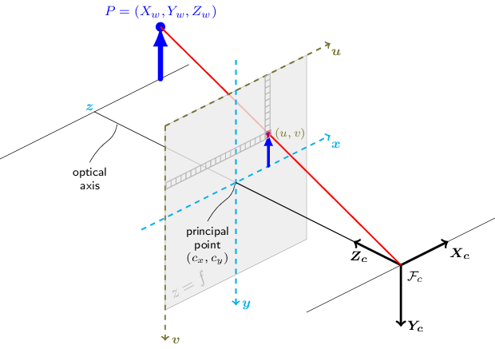

# Graphical Projection

There are two graphical projection categories:

- parallel projection
- perspective projection


# Pinhole Camera Model

the coordinates  of point  depend on the coordinates of point  

- 

- 


Refs: [1](https://en.wikipedia.org/wiki/Pinhole_camera_model#Geometry),
[2](https://ksimek.github.io/2013/08/13/intrinsic/),


# Rotated Image and the Virtual Image Plane

The mapping from 3D to 2D coordinates described by a pinhole camera is a perspective projection followed by a `180°` rotation in the image plane. This corresponds to how a real pinhole camera operates; the resulting image is rotated `180°` and the relative size of projected objects depends on their distance to the focal point and the overall size of the image depends on the distance f between the image plane and the focal point. In order to produce an unrotated image, which is what we expect from a camera we Place the image plane so that it intersects the  axis at `f` instead of at `-f` and rework the previous calculations. This would generate a virtual (or front) image plane which cannot be implemented in practice, but provides a theoretical camera which may be simpler to analyse than the real one.


# Camera Resectioning and Projection Matrix 

Projection refers to the pinhole camera model, a camera matrix  is used to denote a projective mapping from world coordinates to pixel coordinates.


 represent a 2D point position in pixel coordinates and  represent a 3D point position in world coordinates.


<br/>
<br/>


<br/>
<br/>


<br/>
<br/>

    


<br/>
<br/>


    

<br/>
<br/>


<br/>
<br/>


<br/>
<br/>


<br/>
<br/>


<br/>
<br/>

# Example of Projection 


<br/>
<br/>


<br/>
<br/>


<br/>
<br/>


<br/>
<br/>


<br/>
<br/>


<br/>
<br/>

<br/>
<br/>


<br/>
<br/>


<br/>
<br/>


<br/>
<br/>


<br/>
<br/>


projected pints in camera:

<br/>
<br/>


<br/>
<br/>



<br/>
<br/>


# OpenCV API

In OpenCV, `Point(x=coulmn,y=row)`. For instance the point in the following image can be accessed with

```cpp
    X                      
    --------column---------►
    | Point(0,0) Point(1,0) Point(2,0) Point(3,0)
    | Point(0,1) Point(1,1) Point(2,1) Point(3,1)
    | Point(0,2) Point(1,2) Point(2,2) Point(3,2)
  y |
   row
    |
    |
    ▼

```
However if you access an image directly, the order is 

```cpp
    X                      
    --------column---------►
    | mat.at<type>(0,0) mat.at<type>(0,1) mat.at<type>(0,2) mat.at<type>(0,3)
    | mat.at<type>(1,0) mat.at<type>(1,1) mat.at<type>(1,2) mat.at<type>(1,3)
    | mat.at<type>(2,0) mat.at<type>(2,1) mat.at<type>(2,2) mat.at<type>(2,3)
  y |
   row
    |
    |
    ▼
```    


So the following will return the same value:


```cpp
mat.at<type>(row,column) 
mat.at<type>(cv::Point(column,row))
```
For instance:
```cpp
std::cout<<static_cast<unsigned>(img.at<uchar>(row,column))    <<std::endl;
std::cout<<static_cast<unsigned>(img.at<uchar>( cv::Point(column,row))     )<<std::endl;
```


# 3D World Unit Vector

Refs: [1](https://stackoverflow.com/questions/12977980/in-opencv-converting-2d-image-point-to-3d-world-unit-vector),
[2](https://docs.opencv.org/4.x/d9/d0c/group__calib3d.html),
[3](https://stackoverflow.com/questions/44888119/c-opencv-calibration-of-the-camera-with-different-resolution),
[4](https://docs.opencv.org/3.2.0/da/d54/group__imgproc__transform.html#ga55c716492470bfe86b0ee9bf3a1f0f7e),
[5](https://www.mathematik.uni-marburg.de/~thormae/lectures/graphics1/graphics_6_1_eng_web.html#1)


# Resizing Image Effect on the Camera Intrinsic Matrix


