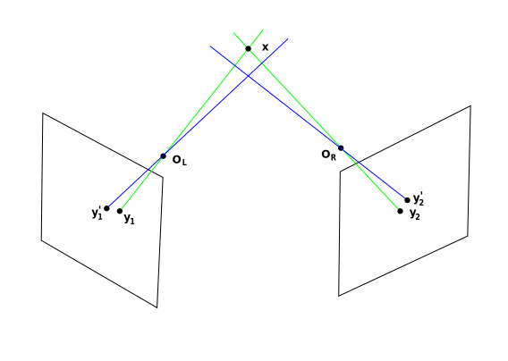

# Triangulation
triangulation is the process of determining a point in 3D space given its projections onto two, or more, images. It is sometimes also referred to as reconstruction or intersection.
In theory if we have the camera matrices, we can compute the intersection camera ray and find the corresponding point in 3D.

  

 
 

 
 

Due to various types of noise (geometric noise from lens distortion or interest point detection error) the lines generated by the corresponding image points do not always intersect in 3D space. The problem, then, is to find a 3D point which optimally fits the measured image points.

In the following image, the image points  and  are the actual projection of point x but the due to the noise  points  and  are detected on cameras and used for the triangulation. The corresponding projection lines (blue) do not, in general, intersect in 3D space and may also not intersect with point x.

A triangulation method can be described in terms of a function  ,  such that

where  are the homogeneous coordinates of the detected image points

# Methods to Solve Triangulation
## Mid-point Method
## Direct Linear Transformation
## Via the Essential Matrix

Refs: [1](https://en.wikipedia.org/wiki/Triangulation_(computer_vision))

